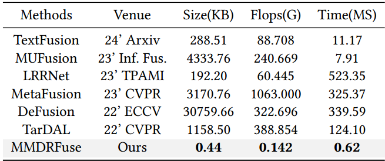
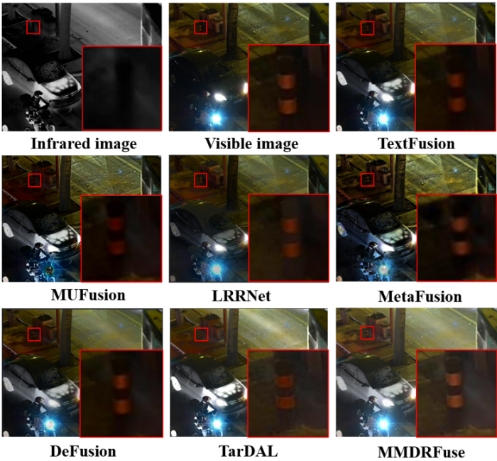

# MMDRFuse 
Yanglin Deng, Tianyang Xu, Chunyang Cheng,Xiao-jun Wu, Josef Kittler,
"MMDRFuse: Distilled Mini-Model with Dynamic Refresh for Multi-Modality Image Fusion", ACM International Conference on Multimedia(ACM MM), 2024.(Oral).

---

---
Left: Comparison of our Mini Model (MMDRFuse) with other advanced image fusion solutions in terms of model efficiency, including model size (KB), average running time (MS), and two image quality assessments SD and VIF. 
Right: Supervision designs of our MMDRFuse, where digestible distillation refers to delivering external soft supervision, dynamic refresh emphasises the historical impact of network parameters during training, and comprehensive loss serves as an internal supervision that absorbs nutrients from source images.

## Experimental results display
Quantitative ablation study for each component on MSRS(The boldface shows the best value).


Quantitative results of IVIF task on LLVIP(Boldface and underline show the best and second-best values):


Qualitative results of IVIF task and MIF task on LLVIP:


Comparison in terms of average detection precision and average speed for RGB-T pedestrian detection.


## Virtual Environment
Please run the following prompt to create accordingly virtual environment.
```
# create virtual environment
conda create -n mmdrfuse python=3.7.3
conda activate mmdrfuse
# install mmdrfuse requirements
pip install -r requirements.txt
```

## To test on the pre-trained model
Pre-trained models of student and teacher are placed in the "models" directory.
You may need to modify related variables in "test_img.py" and the model name in "args_fusion.py".
Put your image pairs in the "test_imgs" directory and run the following prompt: 
```
python test_image.py
```
If you want to obtain the qualitative results in paper, please run the following prompt:
```
python qualitative_measure.py
```
## To prepare training data
Put the source images in the "LLVIP_source" directory and run the following prompt to generate image patches:
```
cd train_imgs
python Generating_patches.py
```
Then the generated_patches will be placed in "train_imgs/LLVIP_patches",and you can begin to train model.
To create your own dataset and compare algorithms in the same environment, you can follow the same process as mentioned before.
## To train
If you want to directly train the student model, please run the following prompt:
```
python train_student.py
```
The training process of the student model will use the pre-trained teacher model.
If you also want to train the teacher model, please run the following prompt:
```
python train_teacher.py
```
The training informaiton (number of samples, batch size etc.) can be changed in the "args_fusion.py"

## Contact Informaiton
If you have any questions, please contact me at <yanglin_deng@163.com>.

## Acknowledgement
Code of this implementation is based on the [MUFusion](https://github.com/AWCXV/MUFusion).


